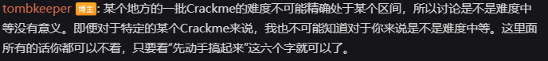
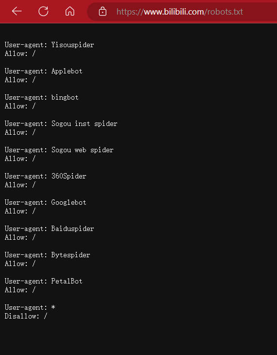
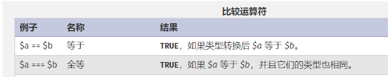
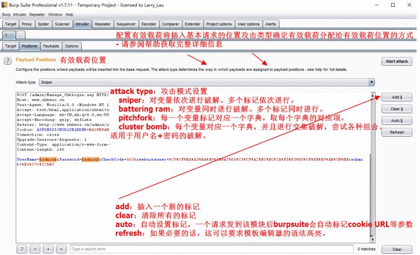
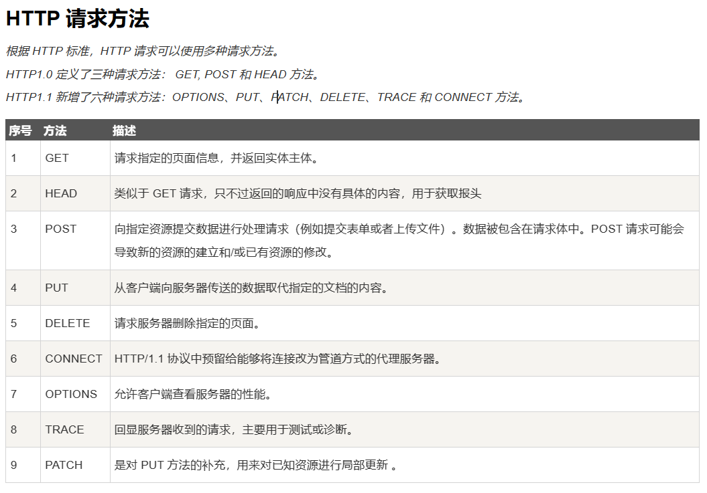
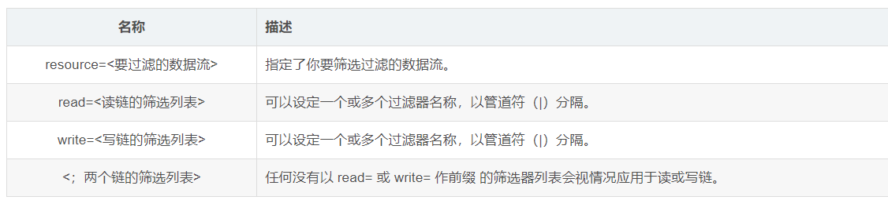

**"先动手搞起来"**

受限于CTF的分支较多，知识点也比较杂，记录一下自己不熟悉的知识点。

<!--more-->

robots协议：网络爬虫排除标准，它是搜索引擎中访问网站的时候要查看的第一个文件。robots.txt文件告诉蜘蛛程序在服务器上什么文件是可以被查看的。 当一个搜索蜘蛛访问一个站点时，它会首先检查该站点根目录下是否存在robots.txt。基于人文道德规范建立的标准，不具备强制性（有点类似于readme.md？）

.php 备份文件后缀：通常备份文件的后缀名为.bak 所以 index. php 的备份文件名为 index.php.bak。



cookie：是web服务器为了识别用户身份而设置的一小段文本文件（一小段数据） 可通过Burpsuite爬取网页中的数据包。[深入理解Cookie - 简书 (jianshu.com)](https://www.jianshu.com/p/6fc9cea6daa2)

Burp爆破模块使用界面：



base64编码：特征是尾部可能会有等于号。

gif隐写：可以使用101editor打开gif图片 若gif图片无法在图片管理器中打开考虑图片是否文档开头中缺少GIF8 `[GIF文件头：47 49 46 38 39 61]`

HTTP请求方法：



php://filter理解：其是php协议中的一个独有的协议，可以作为一个中间流去处理其他流，从而实现任意文件的读取。大部分情况下使用resourse以筛选过滤指定的数据流。
例如：某个网站的规则被制定为：如果直接用get方法请求flag `http://IP:PORT/?p=`会直接被拦截，这时候就可以考虑使用 `http://IP:PORT/?p=php://filter/convert.base64-encode/resource=flag`这样就会绕过拦截规则，以base64的格式输出flag中的文件。



对称加密：对称加密算法是指在加密和解密时使用的是**同一个密钥**。 这种方法速度快，但需要双方事先协商好密钥，并保证密钥不被泄露。它的优点是速度快，效率高，适合加密大量数据。它的缺点是密钥的分发和管理比较困难，如果密钥泄露，加密的数据就会被破解（DES、AES）

非对称加密：非对称加密使用一对密钥来加密和解密数据，其中一个密钥是公开的，叫做公钥，另一个密钥是私密的，叫做私钥。如果使用 **公钥** 对数据  **进行加密** ，只有用对应的 **私钥** 才能  **进行解密** 。它的优点是密钥的分发和管理比较容易，只需要公开公钥，私钥不需要共享。它的缺点是速度慢，效率低，适合加密少量数据（RSA、DSA）

简单来说就是，对称加密是同钥加密，同钥解密。非对称加密是公钥加密，私钥解密。

<details>
<summary>对称加密与非对称加密的代码实现</summary>

```python
# 基本思路是调用pycryptodome(对称加密)和cryptography(非对称加密)实现
# 导入所需的库
import os
import base64
from cryptography.hazmat.primitives.ciphers import Cipher, algorithms, modes
from cryptography.hazmat.primitives.asymmetric import rsa, padding
from cryptography.hazmat.primitives import hashes, serialization
from cryptography.hazmat.backends import default_backend

# 生成一个随机的对称密钥
symmetric_key = os.urandom(32)

# 创建一个AES加密器
aes_cipher = Cipher(algorithms.AES(symmetric_key), modes.CBC(os.urandom(16)), backend=default_backend())

# 定义一个函数，用对称密钥加密数据
def symmetric_encrypt(data):
    # 将数据转换为字节串
    data = data.encode()
    # 创建一个加密器
    encryptor = aes_cipher.encryptor()
    # 对数据进行填充，使其长度为16的倍数
    padding_length = 16 - len(data) % 16
    data = bytes([padding_length]) * padding_length + data
    # 返回加密后的数据，使用base64编码方便显示
    return base64.b64encode(encryptor.update(data) + encryptor.finalize())

# 定义一个函数，用对称密钥解密数据
def symmetric_decrypt(data):
    # 将数据解码为字节串
    data = base64.b64decode(data)
    # 创建一个解密器
    decryptor = aes_cipher.decryptor()
    # 返回解密后的数据，去掉填充的部分
    data = decryptor.update(data) + decryptor.finalize()
    padding_length = data[-1]
    return data[:-padding_length].decode()

# 生成一对非对称密钥
private_key = rsa.generate_private_key(public_exponent=65537, key_size=2048, backend=default_backend())
public_key = private_key.public_key()

# 定义一个函数，用公钥加密数据
def asymmetric_encrypt(data):
    # 将数据转换为字节串
    data = data.encode()
    # 使用公钥和OAEP填充方式进行加密
    return base64.b64encode(public_key.encrypt(data, padding.OAEP(mgf=padding.MGF1(algorithm=hashes.SHA256()), algorithm=hashes.SHA256(), label=None)))

# 定义一个函数，用私钥解密数据
def asymmetric_decrypt(data):
    # 将数据解码为字节串
    data = base64.b64decode(data)
    # 使用私钥和OAEP填充方式进行解密
    return public_key.decrypt(data, padding.OAEP(mgf=padding.MGF1(algorithm=hashes.SHA256()), algorithm=hashes.SHA256(), label=None)).decode()

# 测试一下
data = "Hello, world!"
print("原始数据：", data)
symmetric_data = symmetric_encrypt(data)
print("对称加密后的数据：", symmetric_data)
asymmetric_data = asymmetric_encrypt(data)
print("非对称加密后的数据：", asymmetric_data)
print("对称解密后的数据：", symmetric_decrypt(symmetric_data))
print("非对称解密后的数据：", asymmetric_decrypt(asymmetric_data))

```

</details>

哈希算法：哈希算法是一种单向算法，可以对任意长度的数据生成固定长度的唯一值，称为哈希值或摘要。 哈希算法不能逆向还原原始数据，只能用于验证数据的完整性和一致性。常见的哈希算法有 MD5、SHA-1、SHA-256 等。代码实现较为简单，导入hashlib，再创建一个hash对象即可。
