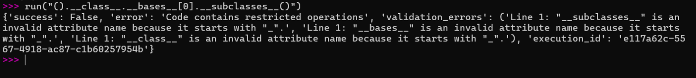
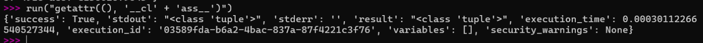

CVE-2026-53710 是一个严重级别的沙箱逃逸漏洞，存在于IBM的[MCP Context Forge](https://github.com/IBM/mcp-context-forge)项目中的python_sandbox_server子项目。它允许攻击者在默认配置下实现RCE，CVSS 评分为10.0。

<!--more-->

## 一、漏洞档案

| 项         | 值                                                                                                       |
| --------- | ------------------------------------------------------------------------------------------------------- |
| CVE       | CVE-2026-53710                                                                                          |
| 通告        | [GHSA-xm98-3vcf-fph7](https://github.com/IBM/mcp-context-forge/security/advisories/GHSA-xm98-3vcf-fph7) |
| CVSS 3.1  | **10.0** `AV:N/AC:L/PR:N/UI:N/S:C/C:H/I:H/A:H`                                                          |
| CWE       | CWE-94 代码注入、CWE-693 保护机制失效                                                                              |
| 受影响       | IBM mcp-context-forge 的 `python_sandbox_server` < 1.0.2                                                 |
| 修复版本      | 1.0.2                                                                                                   |
| 修复 commit | `63a2900e6301b9c8a483a38d3737a1beb3a7ce89`                                                              |
| CVE 发布    | 2026-09-15                                                                                              |
| KEV       | 未收录                                                                                                     |
| EPSS      | 0.00827（55.7 百分位）                                                                                       |

---

CVE记录：[https://www.cve.org/CVERecord?id=CVE-2026-53710](https://www.cve.org/CVERecord?id=CVE-2026-53710)
受影响组件：mcp-contextforge-gateway项目下的python_sandbox_server子项目[](https://app.opencve.io/cve/CVE-2026-53710)。
受影响版本：>= v0.1.0且 < v1.0.2 的所有版本[](https://www.mend.io/vulnerability-database/CVE-2026-53710/)。
修复版本：v1.0.2及更高版本已修复该漏洞[](https://www.mend.io/vulnerability-database/CVE-2026-53710/)。
漏洞的核心原因是`python_sandbox_server`的`RestrictedPython`沙箱配置不当，使得攻击者可以绕过安全限制。

但本质上来说，`RestrictedPython`并不能算作一个沙箱，因为实际上它是一个源到源编译器，通过将用户输入的代码改写成一个被预设好能通过检查的写法，尤其是一些存在危险的写法。

## 二、复现记录

借助AI搭建了一个简单的脚手架文件。

首先尝试最经典的沙箱逃逸payload：


正常来说，对于用户在`RestrictedPython`中提交的代码而言，首先由`validate_code()`调用 `compile_restricted_exec` 对用户的输入作静态检查，`compile_restricted_exec` 在解析和编译阶段如果发现违规，则记录到`CompileResult.errors`字段中。`validate_code()` 根据`CompileResult.errors`非空，把错误通过包装成JSON里的`validation_errors`字段返回。从错误信息也能看出来：它禁止出现`_`开头的属性访问。所以静态检查会把它们直接标记成非法属性名。这也就是这个payload没有通过的原因。

换句话说，`RestrictedPython`只要检测到了代码中类似于`__class__`的写法，就直接标注为危险。但是用来标注危险代码的`validate_code()`函数是利用字符串查找来审阅代码中的危险内容的。

所以基于这个信息，如果让源码中选择不出现完整的包含`__`的字面量，反而通过某种方法拼接出，并且能够真实访问到，就能实现绕过这个检查。
例如：


首先对于`compile_restricted_exec`来说，它没有识别到完整的`__class__`字面量，所以检查通过。`getattr()`方法把`__cl`和`ass__`拼接到了一起，从而实现了绕过。并且因为`getattr()`是原始内建，属于python自带的函数，不会经过改写。

我在写上面这段的时候，查了很多资料，注意到了一个和`getattr()`相近的`_getattr_`函数，二者属于同一类型，并且调用形态也一样，那么为什么`getattr()`和`_getattr_`，前者不会经过管控，而后者会呢？

`getattr()`是内置函数，不受编译器的管控。而`_getattr_` 不是 Python 的内置函数，是 RestrictedPython 自己的约定，属于是在编译期植入的守卫钩子。

了解了这个差异之后回过头看上游源码。
<details>
<summary>点击展开</summary>
```python

def create_safe_globals(self) -> dict[str, Any]:

        """Create a safe global namespace for code execution."""

        # Safe built-in functions

        safe_builtins = {

            # Basic types

            "bool": bool,

            "int": int,

            "float": float,

            "str": str,

            "list": list,

            "dict": dict,

            "tuple": tuple,

            "set": set,

            "frozenset": frozenset,

            "bytes": bytes,

            "bytearray": bytearray,

            # Safe functions

            "len": len,

            "abs": abs,

            "min": min,

            "max": max,

            "sum": sum,

            "round": round,

            "sorted": sorted,

            "reversed": reversed,

            "enumerate": enumerate,

            "zip": zip,

            "map": map,

            "filter": filter,

            "all": all,

            "any": any,

            "range": range,

            "print": print,

            "isinstance": isinstance,

            "issubclass": issubclass,

            "hasattr": hasattr,

            "getattr": getattr,

            "setattr": setattr,

            "callable": callable,

            "type": type,

            "id": id,

            "hash": hash,

            "iter": iter,

            "next": next,

            "slice": slice,

            # String/conversion methods

            "chr": chr,

            "ord": ord,

            "hex": hex,

            "oct": oct,

            "bin": bin,

            "format": format,

            "repr": repr,

            "ascii": ascii,

            # Math

            "divmod": divmod,

            "pow": pow,

            # Constants

            "True": True,

            "False": False,

            "None": None,

            "NotImplemented": NotImplemented,

            "Ellipsis": Ellipsis,

        } 
       ```
        </details>

在safe_builtins字典中直接暴露了原始内建`getattr`、`setattr`和`hasattr`，没有用RestrictedPython的守卫钩子`_getattr_`来替换或限制它们。因此就产生了利用__class__构建漏洞的可能。

因此在新版本的源码中，可以看到做了以下改动。


```python
_SAFE_DUNDER_ATTRS = frozenset({...})  # 白名单，只允许安全的 dunder

def _guarded_getattr(obj, name, *args):
    if isinstance(name, str) and name.startswith("__") and name not in _SAFE_DUNDER_ATTRS:
        raise AttributeError(f"Access to attribute '{name}' is blocked by sandbox policy")
    if args:
        return getattr(obj, name, args[0])
    return getattr(obj, name)

def _guarded_setattr(obj, name, value):
    if isinstance(name, str) and name.startswith("__"):
        raise AttributeError(f"Setting attribute '{name}' is blocked by sandbox policy")
    setattr(obj, name, value)
```
引入 `_guarded_getattr` / `_guarded_setattr` 守卫，并强制注入。

并且在`create_safe_globals()`也做了修改
```python
globals_dict = {
    "__builtins__": safe_builtins,
    "_getattr_": _guarded_getattr,
    "_setattr_": _guarded_setattr,
    **safe_imports,
}
```


RestrictedPython 编译期会把所有 `obj.attr` 重写为 `_getattr_(obj, 'attr')`。修补前，`_getattr_` 可能被 RestrictedPython 默认实现或自定义的原始 `getattr` 覆盖；修补后，自定义守卫被显式注入，且白名单只放行安全的 dunder（如 `__str__`、`__len__` 等），`__class__`、`__subclasses__`、`__globals__` 等一律拦截。

`safe_builtins` 中移除了原始 `getattr`、`setattr`、`hasattr`。

```python
def create_safe_globals(self) -> dict[str, Any]:

        """Create a safe global namespace for code execution."""

        # Safe built-in functions

        safe_builtins = {

            # Basic types

            "bool": bool,

            "int": int,

            "float": float,

            "str": str,

            "list": list,

            "dict": dict,

            "tuple": tuple,

            "set": set,

            "frozenset": frozenset,

            "bytes": bytes,

            "bytearray": bytearray,

            # Safe functions

            "len": len,

            "abs": abs,

            "min": min,

            "max": max,

            "sum": sum,

            "round": round,

            "sorted": sorted,

            "reversed": reversed,

            "enumerate": enumerate,

            "zip": zip,

            "map": map,

            "filter": filter,

            "all": all,

            "any": any,

            "range": range,

            "print": print,

            "isinstance": isinstance,

            "issubclass": issubclass,

            "callable": callable,

            "type": type,

            "id": id,

            "hash": hash,

            "iter": iter,

            "next": next,

            "slice": slice,

            # String/conversion methods

            "chr": chr,

            "ord": ord,

            "hex": hex,

            "oct": oct,

            "bin": bin,

            "format": format,

            "repr": repr,

            "ascii": ascii,

            # Math

            "divmod": divmod,

            "pow": pow,

            # Constants

            "True": True,

            "False": False,

            "None": None,

            "NotImplemented": NotImplemented,

            "Ellipsis": Ellipsis,

        }
```

`validate_code`中针对静态检查做了修改
```python
tree = ast.parse(code)
for node in ast.walk(tree):
    if isinstance(node, ast.Attribute):
        attr = node.attr
        if attr.startswith("__") and attr not in _SAFE_DUNDER_ATTRS:
            security_issues.append(f"Potentially dangerous attribute access in source: {attr}")
```
静态字符串匹配可被 `"__cl" + "ass__"` 轻易绕过；AST 分析能准确捕获源码中静态写出的 `obj.__class__`，减少误报和漏报。运行时拼接的字符串虽然能通过静态检查，但会在执行时被 `_guarded_getattr` 拦截。

