发现了一个很棒的靶场，里面囊括了Web方向的大多数常见漏洞，并且还分了四个难度等级（Low,Medium,High,Impossible），很适合目前我的需求。

<!--more-->

TODO:

* [ ] Low
* [ ] Medium
* [ ] High
* [ ] Impossible

Brute Force(暴力破解)

Low

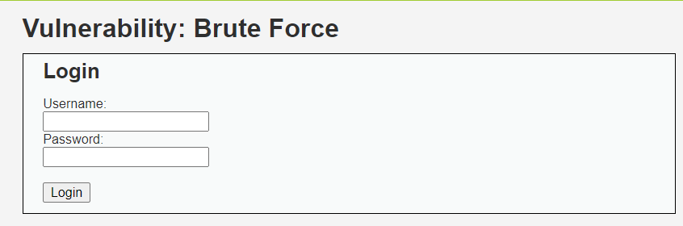

先随意选择一组用户名和密码看看会发生什么。

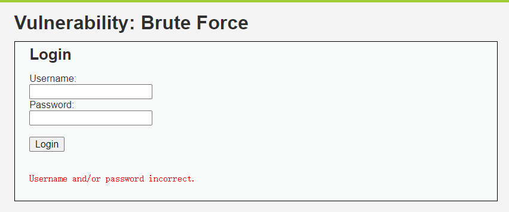

显示用户名和/或密码错误，除此之外没有任何的机制。所以考虑使用Burp的Intruder模块对用户名和密码进行爆破。

这里由于username和password都需要爆破。所以考虑Pitchfork模块或者Cluster Bomb模块（Sniper和Batteringram只能导入一个payload），这里选择Clusterbomb。

选择字典之后开始爆破。

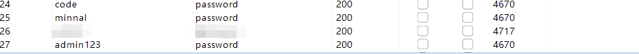

发现了一个长度明显有差异的返回长度。输入进去。

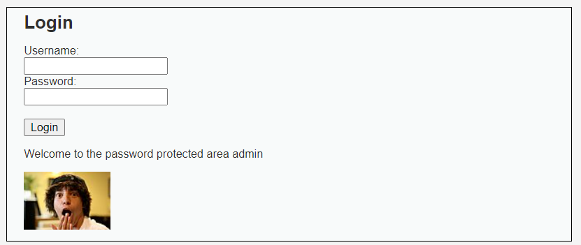

---

Command Injection(指令注入)

Low

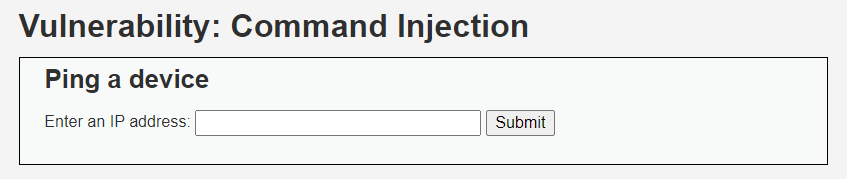
~~（是知识盲区~~  尝试着分析了一下，工作原理可能是直接将输入框内的文字与ping命令进行拼接。

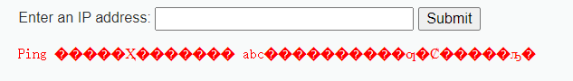

并且不能过滤不合法的输入，那么尝试一下用&符号进行注入。~~（windows命令行指令都是啥来着~~

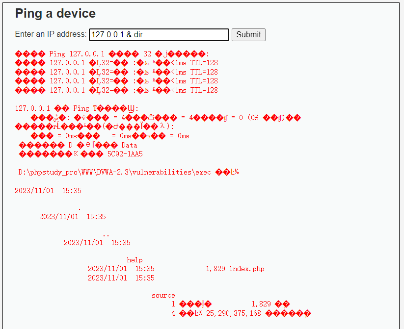

---

CSRF(Cross Site Request Forgery)(跨站请求伪造)

Low

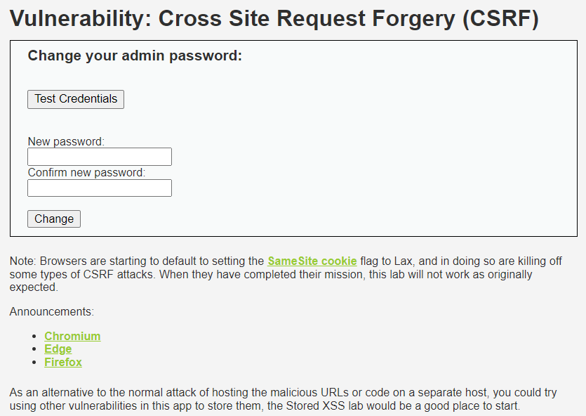

尝试抓个包。

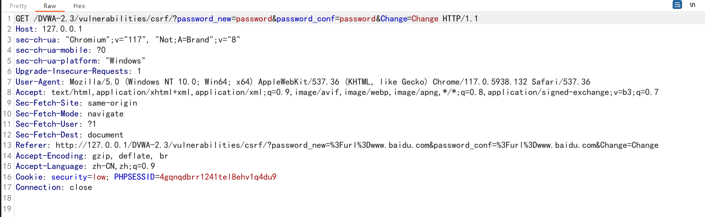

发现是直接传递了新的密码和确认的密码，同时查看源代码发现是直接判断New password和Conf password是否相等，并没有其他的验证。

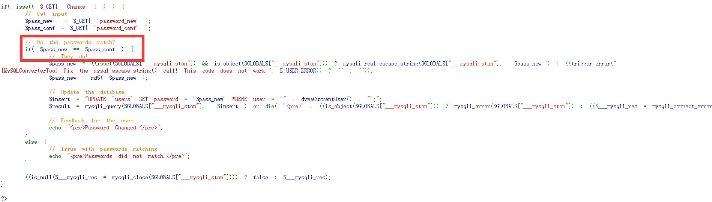

~~普通版burp不具备生成CSRF poc的功能，换个工具先（~~    burp汉化破解链接 `https://www.52pojie.cn/thread-1544866-1-1.html`

或者不使用poc工具，直接构造链接 `http://127.0.0.1/DVWA-2.3/vulnerabilities/csrf/?password_new=123&password_conf=123&Change=Change#` 即可 ，或者再用短链接生成器包装一下看着像那么回事也可以。

---

File Inclusion(文件包含)

Low

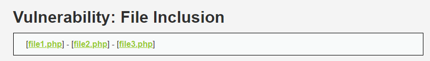

页面上给了三个php文件，逐个点击后没有发现特别有用的信息。

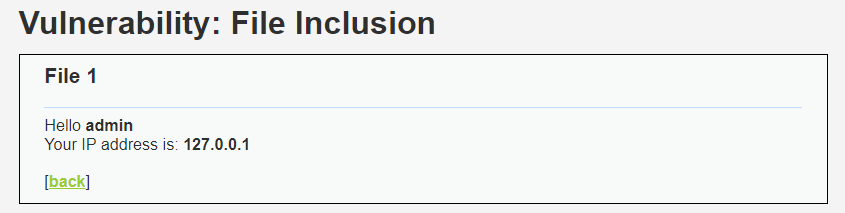

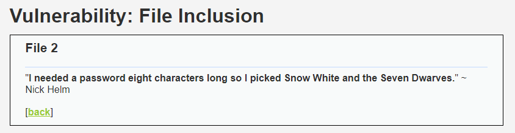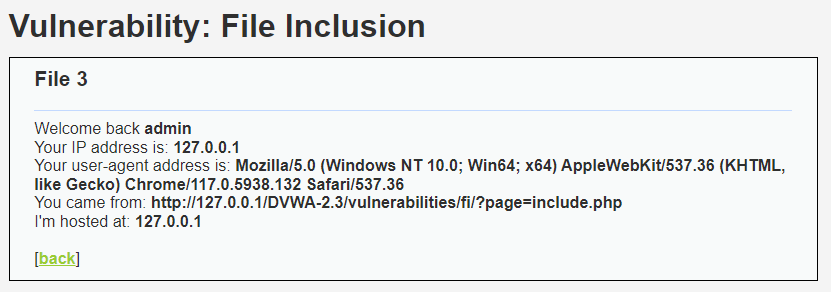

然后注意到了浏览器的网址栏，发现所谓php文件的读取是直接将php文件传入page中再读出来，联系到标题的文件隐藏，尝试着将page=file3.php改成page=file4.php。

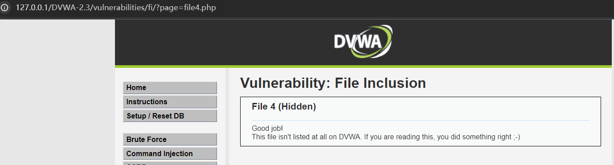

---

File Upload(文件上传漏洞)

Low

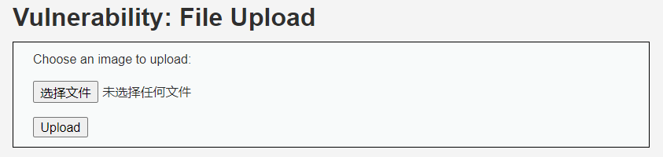

虽然说是上传图片，但是源代码中没有对上传文件的格式作要求

一句话木马干就完了 `<?php @eval($_POST['z']);?>`

~~tmd卡巴斯基怎么又给我的文件清理了~~

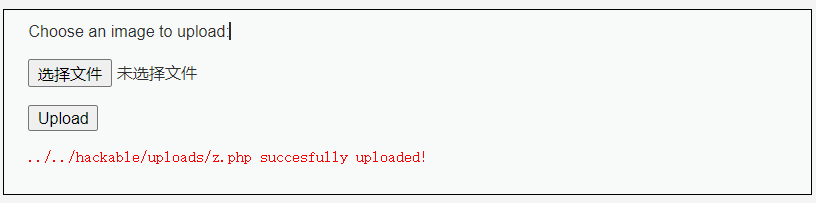

上传成功，可以看到下面回显了路径，然后用蚁剑连接或者拼接路径也可以

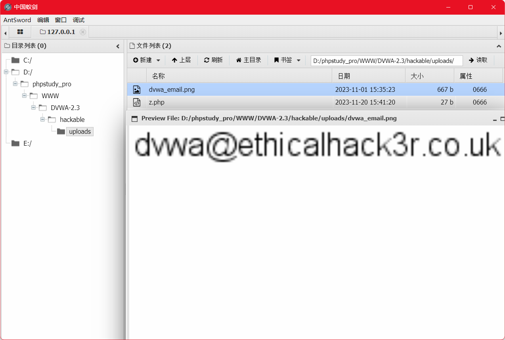

成功（记得把php文件删掉

---

Insecure CAPTCHA(不安全验证码)

**因配置验证码的key有问题，所以暂时搁置**

---

SQL Injection(SQL注入)

Low

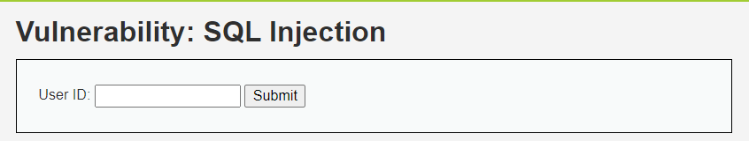

> SQL注入的第一步就要判断注入类型。一般来说，SQL注入按照**参数分类**分为：**字符型**和**数字型**，按照**页面回显**分为**回显注入**和**盲注**，**回显**分为**回显正常**和**回显报错**，**盲注**分为**时间盲注**和**布尔盲注**。
>
> [漏洞挖掘学习笔记 | Eklos&#39;s Blog (eklos9z.github.io)](https://eklos9z.github.io/2023/10/22/%E6%BC%8F%E6%B4%9E%E6%8C%96%E6%8E%98%E5%AD%A6%E4%B9%A0%E7%AC%94%E8%AE%B0/#more)

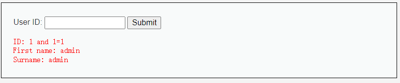

