由于厚米的服务器过期了，不好意思找他续费，于是决定自己搭一个blog，国内的要么广告多（X书），要么后台略显老旧（X园），几经挑选之后决定利用hexo在github上搭建。

搭建的过程基本参考了[【基础篇】hexo博客搭建教程](https://www.cnblogs.com/huanhao/p/hexobase.html#%E9%85%8D%E7%BD%AE%E4%B8%BB%E9%A2%98)。
但是可能是由于版本更新的问题，遇到了一些意料之外的情况。

同时基于原本的教程增加了一些新功能并作此记录。

* [X] 2023/12/1：记录了添加谷歌日历订阅的简易过程
* [X] 2024/4/30 :  记录了修正hexo new生成页面需要手动修改类型(categorie -> categories)的问题

<!--more-->

问题汇总
--------

1. 在git bash中执行安装cnpm出错
   错误1：Error: EPERM: operation not permitted
   解决方案：利用管理员模式打开git即可。
   错误2：ERR! code EPERM
   解决方案：将C:/user/用户名/.npmrc删除（需要打开隐藏文件）。
2. 上传github时页面主题未显示
   解决方案：分别在博客页面所在的文件夹执行hexo clean后再执行hexo g -d与 hexo d。（无法确认究竟是什么导致的问题，推测是缓存问题。）
3. 修改schemes后上传无效
   删除themes/next 中的.git（隐藏），再重新执行hexo g -d与 hexo d即可.

另：由于github的项目规则更改，如果按照链接中的教程会将页面信息上传到项目的master分支中，此时只需将（根目录下的）页面配置文件中的branch项改成main即可。

4. 图片插入无法显示

   图片根目录位于 /博客名称/themes/主题名/source/images。即如果需要插入图片，需要引用的代码格式为 :`！ ))`

   可以用hexo s在本地页面中检查是否成功，同时本地页面可以动态调整。
5. 新版hexo下文章创建无法分段

   需要在文章正文需要分段的地方自行添加 `<!--more-->`

增加谷歌日历订阅
----------------

展开

（以信息来源：[CTFHub calendar](https://www.ctfhub.com/#/calendar)为例）

1. 打开主题内的_config.yml,找到calendar备用（\themes\next\_config.yml）。
   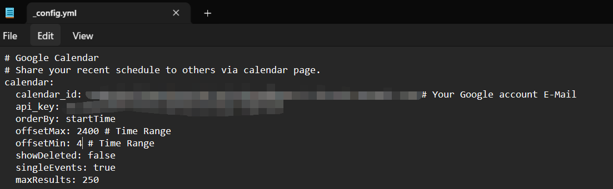
2. 打开谷歌开发控制板 `https://console.cloud.google.com/apis/dashboard` ，创建一个新项目（名字随意，位置默认）。
   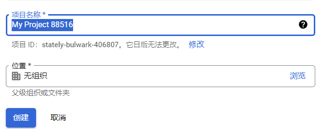
3. 在上方搜索框中搜索：Google calendar api.选择并启用。
   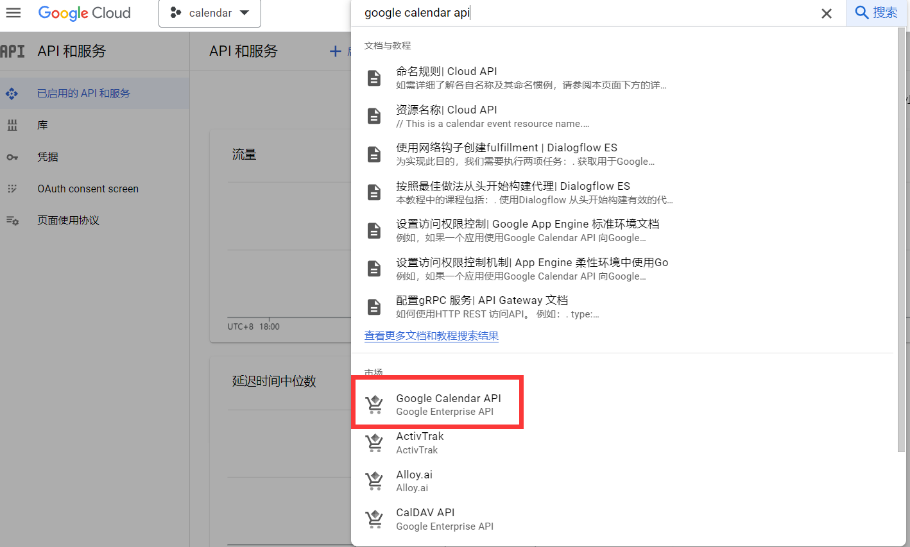
4. 打开OAuth consent screen，名称随意，User type选外部，邮箱填写自己的即可，范围勾选所有的Google calendar api。测试用户不用管，然后继续
   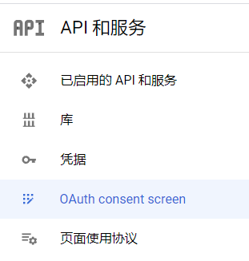
5. 打开凭据，选择创建凭据-api密钥，复制生成的密钥到_config.yml中的api_key里。
   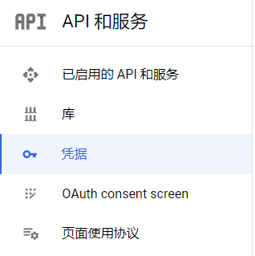
   5.5. 如果有需要可以在api设置中add自己的网站为过滤条件，可以防止api被恶意使用（可选）
   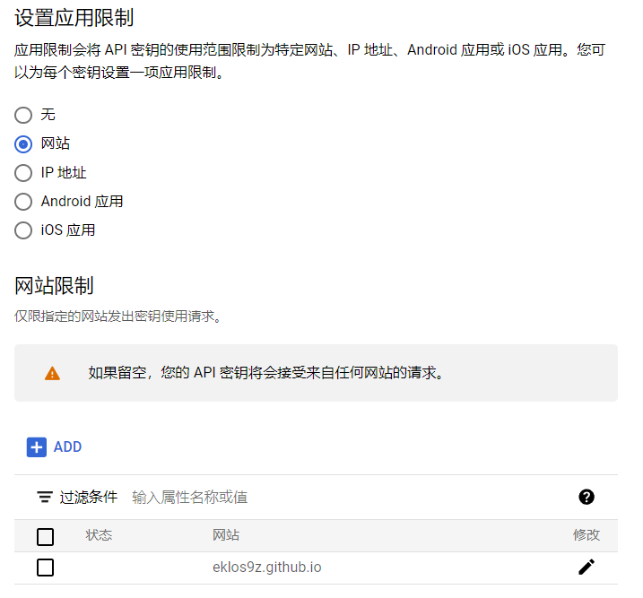
6. 打开谷歌日历，打开设置-添加日历-通过网址添加
   
7. 打开刚才添加的日历，找到集成日历，复制集成日历的日历ID。（如果添加的是自己的日历需要将日历设置为公开）
   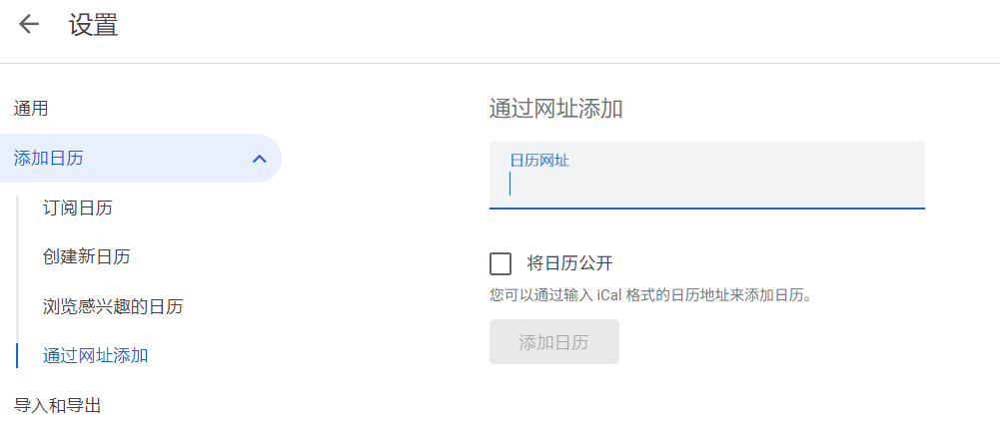
8. 将日历id填入_config.yml。

   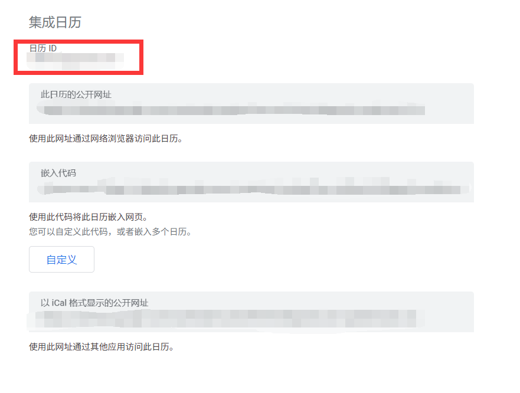
9. 在网站根目录用命令 `hexo new page schedule`创建日程表页面。
10. 修改刚刚创建的页面，添加 `type: scheldule`，可自定义修改名字。
    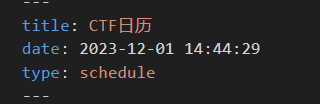
11. 启用menu中的schedule。
    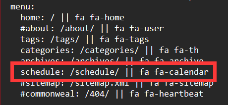
12. hexo s 在本地查看无误后分别执行 `hexo clean`和 `hexo g -d`推送。

修正hexo new生成页面需要手动修改类型(categorie -> categories)的问题
-------------------------------------------------------------------

展开

不确定是我个人的问题，还是hexo的普遍问题，此问题曾导致：使用 `hexo new`生成页面时，默认生成的页面里categories拼写错误，需要手动修改。
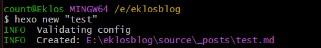
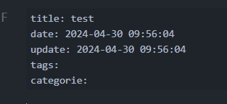
解决方案：进入 `.\%BLOG_NAME%\scaffolds`里修改自己使用的页面默认格式。
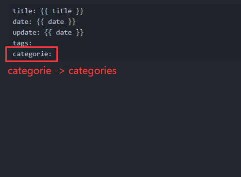
如果不确定自己使用的哪个页面，前往根目录的 `_config.yaml`里的 `default_layout`列查看

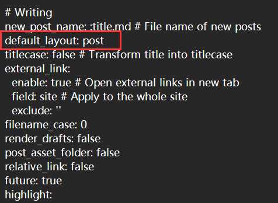

