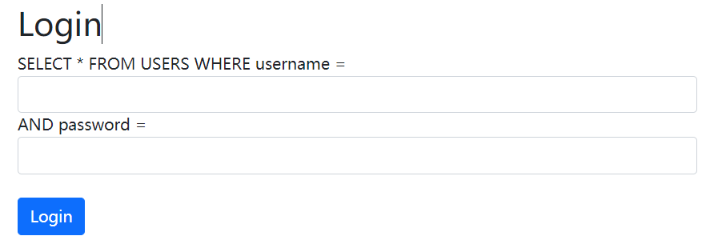

为什么 `<!--more-->`之前必须得写点东西

<!--more-->

<details>
<summary>OWASP top10</summary>


</details>

---

<details>
<summary>逻辑漏洞</summary>

工具：Burp

属于业务本身可能产生的漏洞。

个人信息部分中可能出现文件上传漏洞，XSS，暴力破解验证码等；主要体现在是否会向后端传入一些数据。利用Burp篡改传入的输入达到相应的目的。大部分需要自己尝试。

</details>

---

<details>
<summary>URL跳转漏洞</summary>

体现在url网址中后方加入?returnurl= 或者是?sec= ?url=

可以让点击链接的用户重定向自后方的网址，会被原网址WAF拦截。

常见于业务完成场景中，如：修改密码成功、用户分享、收藏的跳转等。

url跳转bypass。

利用问号、@绕过限制。

</details>

---

<details>
<summary>短信轰炸漏洞</summary>

发送短信/邮件的包会无限制的发送。

场景常见于登录、注册、找回密码等需要会产生短信交互或者邮箱交互中。

主要利用途径burp的repeater模块进行重复发送。

bypass思路：

在mobile参数后面加上%20、字母等，或者修改大小写、修改cookie值或者利用调用接口绕过。

</details>

---

<details>
<summary>注入</summary>

注入攻击的本质是使应用违背"数据与代码分离"的原则。满足注入攻击有两个基本条件：

1. 用户能控制数据的输入。
2. 程序拼凑了数据。

<details>
<summary>SQL注入</summary>

SQL注入的原理是利用web程序对用户输入的数据没有严格的过滤和判断，主要被用来在url或者表单中输入特殊的字符或者语句，根据数据库的反馈判断是否存在SQL注入的可能性，一般有一下几种方法：

1. 单引号法：在参数后加入单引号，如 `?id=1'`,如果页面返回错误或者汇报异常，说明存在SQL注入的可能性，因为无论是字符型还是整型都会因为单引号个数不匹配而报错
2. and语句法：在参数后面加上and语句，如 `id=1 and 1=1`与 `id=1 and 1=2`，如果页面返回的结果不同，说明存在SQL注入的可能性。因为and语句会影响SQL语句的逻辑判断，从而影响查询的结果。不仅仅限于and，or、not在某些情况下都可以用作注入。
3. 注释符法：在参数后面加上注释符，如 `id=1#`，如果页面的返回结果不同，说明存在SQL注入的可能性。因为注释符的存在会使剩下的语句部分失效，从而改变查询的结果。

SQL注入的第一步就要判断注入类型。一般来说，SQL注入按照**参数分类**分为：**字符型**和**数字型**，按照**页面回显**分为**回显注入**和**盲注**，**回显**分为**回显正常**和**回显报错**，**盲注**分为**时间盲注**和**布尔盲注**。

字符型注入：注入的数据类型是字符，需要使用引号来包围，例如，`name='admin'`，语句原型是 `select * from [lable name] where [conditions]` 。通过构建类似  `name='admin' and '1'='1'`的语句来判断。

数字型注入：注入的数据类型是数字，和字符型注入类似，但是不需要引号包围，例如，`id=1`，语句原型是 `selcet * from [lable name] where [conditions]`。可以构建类似于 `id=1 and 1=1`类似的语句来判断。

回显注入：回显注入的前提是数据库的查询结果会显示在页面上，通过构造联合查询和子查询的语句以获取数据库的其他信息。例如，`http://www.example.com/news.php?id=1' union select version(),user(),database(),z #`，这样就可以尝试获取数据库的其他信息。其中 `z`标识占位符，`#`表示将后方的语句注释掉。

时间盲注：时间盲注的特点是输入的数据被拼接到SQL语句执行的时候，数据库的查询结果不会显示到页面上，只能通过页面的响应时间去判断条件是否正确，一般采用数据库的一些时间函数以制造延迟，比如MYSQL的 `SLEEP、BENCHMARK`，PostgreSQL的 `PG_SLEEP、GENERATE_SERIES`，MSSQL SERVER的 `WAITFOR DELAY`。基本利用原理是判断第一个字母是否为某个字母，如果是真则利用时间函数制造一个较长的延迟，如果是假则不做处理，这样就可以逐个套取出整个数据库名或者需要的信息。

布尔盲注：布尔盲注与时间盲注类似，查询结果只会返回ture和false。通常采用Substring进行截取，格式为 `Substring(被截取字符串，从第几位开始截取，截取长度)`。如果Substring被waf过滤掉了，可以考虑使用left()、right()、mid()这类等价的函数。

万能密码：用户名填admin' or 1--。密码随便填，原理是用--注释掉后面的语句，并且因为or语句的存在语句一定为真，并且由于后方的语句被注释，password这一栏填什么都无所谓。



如何防范SQL注入：

1. 使用预编译的SQL语句，SQL语句的语义不会发生改变，例如将SQL语句 `INSERT INTO class(name,id,sex) VALUES(?,?,?)`中的变量用 `?`来表示,即使使用了 `'`去尝试进行SQL注入，系统也只会将其作为参数的一部分来执行
   。
2. 检查输入数据的数据类型，例如

```php
<?php
settype($offset,'integer')；
$query = "SELECT id, name FROM products ORDER BY name LIMIT 20 OFFSET $offset;";
$query = sprintf("SELECT id ,name FROM products ORDER BY name LIMIT 20 OFFSET %d;",$offset);
?>
```

上面的代码就限制了输入数据的类型只能是int格式，这样也在一定程度上可以防范注入。
3. 遵循最小权限原则，避免web应用使用root、dbowner等高权限账户直接连接数据库，什么级别的使用者赋予什么级别的权限。

</details>
<details>
<summary>XML注入</summary>

和SQL注入相似，只是目标位于HTML网页上。

</details>

<details>
<summary>代码注入</summary>
同上，但是代码注入和命令注入往往是由一些不安全的函数引起的，例如常见的一句话木马

```php
<?php @eval($_POST['z']);?>
```

eval()函数本身是将括号里的内容按照php代码处理。$_POST是将后面的[]内容以POST方法发送，即页面从eval()函数中得到了 `z`这个参数值。`@`的意义是即使执行错误也不报错。

</details>

</details>

---

<details>
<summary>目录遍历</summary>

一般是指系统后台的目录由于各种原因被探测到，导致网站目录与文件泄露，造成的后果通常根据目录的内容决定。一般情况下会被waf拦截，但是可以通过php://filter尝试绕过。

</details>

---

<details>
<summary>phpinfo漏洞</summary>

指通过phpinfo页面进行漏洞利用从而暴露整个php环境，包括物理目录等敏感信息，也可以利用物理机上留存的一些靶场（例如phpstudy等）进入。

</details>

---

<details>
<summary>备份文件下载</summary>

指开发人员在线上环境中对源代码进行了备份操作，并且将备份文件放在了目录下，就可以利用扫描工具进行扫描从而获得网站源码。

常见的网站源码备份文件后缀tar、tar.gz、zip、rar。

常见的网站源码备份文件名web、website、backup、back、www、wwwroot、temp。

如果是index.php可能还会有index.php.bak。

</details>

---

<details>
<summary>vim缓存</summary>

当开发人员在线上使用vim编辑器，在使用过程中会留下vim编辑器缓存，当vim异常退出时，vim缓存会一直留在服务器上，引起网站源码泄露。

可以利用vim命令recover为原本的文件，进而查看源码。

因为vim缓存文件是固定格式的二进制文件，在vim缓存中这些明文字符会保留。

</details>

---

<details>
<summary>任意文件读取漏洞</summary>

指通过一些手段读取到服务器上开发者不希望其他人读取到的文件

</details>

---

<details>

<summary>正则表达式绕过</summary>
正则表达式的原理是对规定的字符进行绕过，从而某种程度上增加注入的难度。
绕过的思路如下：

</details>

---

<details>
<summary>文件上传漏洞</summary>
文件上传漏洞一般产生于出现文件上传点的区域中，实战中包括：头像上传、资料上传等，都可能隐含文件上传漏洞。可以通过逐个改变上传文件后缀以及上传文件头判断服务器的防守策略。
一般对这些上传点有以下的防范措施：

1. 黑名单，即只要检测到文件后缀有.php、.asp、.jsp等一律禁止。一般可以尝试使用多后缀如1.jpg.php，通过嵌套多个后缀混淆服务器的判断。或者可以尝试使用大小写变形后缀，如PhP、PHp此类。

2. 白名单，即只允许文件后缀为.jpg、.png、.gif等。绕过思路为使用%00进行截断。

3. 文件头识别，即服务器对于上传文件的文件头进行识别。一般与白名单结合，仅通过文件头为：	FFD8FF（jpg）、89504E47（png）、47494638（gif）等。需要使用winhex工具对上传文件的文件头进行修改。
</details>
